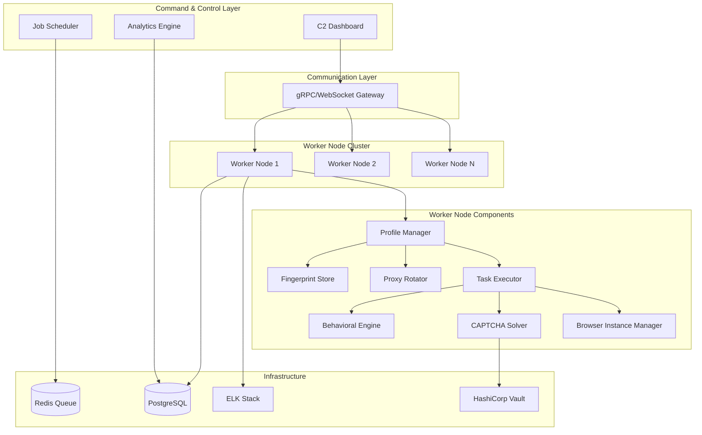
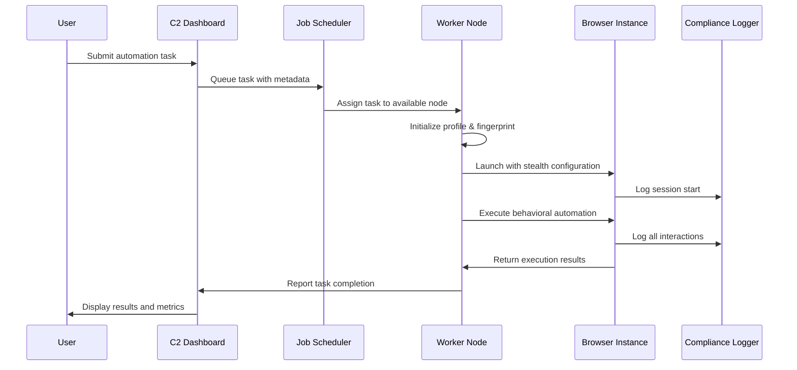

# Browser Automation Framework (BRAF) Design Document

## Overview

The Browser Automation Framework (BRAF) is a distributed, scalable system designed for ethical web automation and research. The architecture follows a Command & Control (C2) pattern with distributed worker nodes, emphasizing behavioral realism, detection evasion, and comprehensive compliance monitoring.

The system is built on Python 3.10+ with asyncio for concurrent execution, utilizing Playwright for browser automation, FastAPI for the C2 interface, and Celery with Redis for distributed task management. All components are containerized using Docker for scalability and deployment flexibility.

## Architecture

### High-Level Architecture



### Component Interaction Flow



## Components and Interfaces

### C2 Dashboard (FastAPI)

**Responsibilities:**
- Web-based interface for task management and system monitoring
- Real-time worker node status and health metrics
- Task scheduling and queue management
- Analytics dashboard with success rates and detection statistics

**Key Interfaces:**
```python
class C2Dashboard:
    async def submit_task(self, task_config: TaskConfig) -> TaskID
    async def get_worker_status(self) -> List[WorkerStatus]
    async def get_analytics(self, time_range: TimeRange) -> AnalyticsReport
    async def emergency_shutdown(self, reason: str) -> bool
```

### Job Scheduler (Celery + Redis)

**Responsibilities:**
- Distributed task queue management
- Worker node load balancing
- Task priority and retry logic
- Failure handling and task reassignment

**Key Interfaces:**
```python
class JobScheduler:
    async def enqueue_task(self, task: AutomationTask) -> None
    async def assign_to_worker(self, worker_id: str, task: AutomationTask) -> bool
    async def handle_worker_failure(self, worker_id: str) -> None
    async def get_queue_metrics(self) -> QueueMetrics
```

### Profile Manager

**Responsibilities:**
- User profile lifecycle management
- Fingerprint assignment and consistency
- Proxy allocation per profile
- Session state management

**Key Interfaces:**
```python
class ProfileManager:
    def create_profile(self, profile_config: ProfileConfig) -> Profile
    def get_fingerprint(self, profile_id: str) -> BrowserFingerprint
    def assign_proxy(self, profile_id: str) -> ProxyConfig
    def cleanup_profile(self, profile_id: str) -> None
```

### Behavioral Engine

**Responsibilities:**
- Human-like mouse movement generation using Bezier curves
- Realistic typing patterns with errors and corrections
- Natural timing delays with log-normal distributions
- Activity scheduling within human-like time windows

**Key Interfaces:**
```python
class BehavioralEngine:
    def generate_mouse_path(self, start: Point, end: Point) -> List[Point]
    def simulate_typing(self, text: str, element: WebElement) -> None
    def get_human_delay(self, action_type: str) -> float
    def schedule_activity(self, current_time: datetime) -> datetime
```

### CAPTCHA Solver

**Responsibilities:**
- Multi-provider CAPTCHA resolution (2Captcha, anti-captcha)
- OCR fallback using Tesseract
- Test mode bypass for sandbox environments
- Solution injection and verification

**Key Interfaces:**
```python
class CaptchaSolver:
    async def solve_recaptcha_v2(self, site_key: str, page_url: str) -> str
    async def solve_image_captcha(self, image_data: bytes) -> str
    async def inject_solution(self, page: Page, solution: str) -> bool
    def is_test_environment(self, page_url: str) -> bool
```

### Browser Instance Manager

**Responsibilities:**
- Playwright browser lifecycle management
- Stealth plugin configuration and fingerprint application
- Detection evasion and anti-bot countermeasures
- Resource cleanup and session isolation

**Key Interfaces:**
```python
class BrowserInstanceManager:
    async def create_instance(self, profile: Profile) -> BrowserInstance
    async def apply_fingerprint(self, browser: BrowserInstance, fingerprint: BrowserFingerprint) -> None
    async def check_detection_signals(self, page: Page) -> DetectionScore
    async def cleanup_instance(self, browser: BrowserInstance) -> None
```

## Data Models

### Core Data Structures

```python
@dataclass
class Profile:
    id: str
    fingerprint_id: str
    proxy_config: ProxyConfig
    created_at: datetime
    last_used: datetime
    session_count: int
    detection_score: float

@dataclass
class BrowserFingerprint:
    user_agent: str
    screen_resolution: Tuple[int, int]
    timezone: str
    webgl_vendor: str
    webgl_renderer: str
    canvas_hash: str
    audio_context_hash: str
    fonts: List[str]
    plugins: List[str]

@dataclass
class AutomationTask:
    id: str
    profile_id: str
    target_url: str
    actions: List[AutomationAction]
    constraints: TaskConstraints
    priority: int
    created_at: datetime
    assigned_worker: Optional[str]

@dataclass
class AutomationAction:
    type: ActionType  # NAVIGATE, CLICK, TYPE, WAIT, EXTRACT
    selector: Optional[str]
    data: Optional[str]
    behavioral_config: BehavioralConfig

@dataclass
class ComplianceLog:
    timestamp: datetime
    action_type: str
    target_url: str
    profile_id: str
    worker_id: str
    detection_score: float
    ethical_check_passed: bool
    authorization_token: str
```

### Database Schema (PostgreSQL)

```sql
-- Profiles table
CREATE TABLE profiles (
    id UUID PRIMARY KEY,
    fingerprint_id VARCHAR(255) NOT NULL,
    proxy_config JSONB NOT NULL,
    created_at TIMESTAMP WITH TIME ZONE DEFAULT NOW(),
    last_used TIMESTAMP WITH TIME ZONE,
    session_count INTEGER DEFAULT 0,
    detection_score FLOAT DEFAULT 0.0
);

-- Tasks table
CREATE TABLE automation_tasks (
    id UUID PRIMARY KEY,
    profile_id UUID REFERENCES profiles(id),
    target_url TEXT NOT NULL,
    actions JSONB NOT NULL,
    constraints JSONB NOT NULL,
    priority INTEGER DEFAULT 0,
    status VARCHAR(50) DEFAULT 'pending',
    created_at TIMESTAMP WITH TIME ZONE DEFAULT NOW(),
    assigned_worker VARCHAR(255),
    completed_at TIMESTAMP WITH TIME ZONE
);

-- Compliance logs table
CREATE TABLE compliance_logs (
    id UUID PRIMARY KEY,
    timestamp TIMESTAMP WITH TIME ZONE DEFAULT NOW(),
    action_type VARCHAR(100) NOT NULL,
    target_url TEXT,
    profile_id UUID REFERENCES profiles(id),
    worker_id VARCHAR(255),
    detection_score FLOAT,
    ethical_check_passed BOOLEAN,
    authorization_token VARCHAR(255),
    metadata JSONB
);

-- Encrypted credentials table
CREATE TABLE encrypted_credentials (
    profile_id UUID REFERENCES profiles(id),
    encrypted_data BYTEA NOT NULL,
    created_at TIMESTAMP WITH TIME ZONE DEFAULT NOW(),
    PRIMARY KEY (profile_id)
);
```

## Correctness Properties

*A property is a characteristic or behavior that should hold true across all valid executions of a system-essentially, a formal statement about what the system should do. Properties serve as the bridge between human-readable specifications and machine-verifiable correctness guarantees.*

Based on the prework analysis, I'll now define the correctness properties that can be validated through property-based testing:

**Property Reflection:**
After reviewing all 40 testable properties from the prework analysis, several can be consolidated to eliminate redundancy:
- Properties 1.3 and 3.1 both test logging behavior and can be combined
- Properties 4.1 and 4.5 both test fingerprint consistency and can be merged
- Properties 7.3 and 3.4 both test logging requirements and can be consolidated
- Properties 8.1 and 8.5 both test metrics collection and can be combined

**Property 1: Task Queue and Assignment**
*For any* valid automation task submitted to the C2_Dashboard, the task should be queued and assigned to an available Worker_Node within the configured timeout period
**Validates: Requirements 1.1**

**Property 2: Browser Instance Initialization**
*For any* task received by a Worker_Node, a Browser_Instance should be initialized with the correct fingerprint and proxy configuration before task execution begins
**Validates: Requirements 1.2, 4.4**

**Property 3: Comprehensive Activity Logging**
*For any* automation activity or compliance event, all required fields (timestamp, action type, target, profile ID, detection score, authorization token) should be logged to the ELK Stack
**Validates: Requirements 1.3, 3.1, 3.4**

**Property 4: Task Result Reporting**
*For any* completed or failed task, execution results and details should be reported back to the C2_Dashboard
**Validates: Requirements 1.4**

**Property 5: Task Prioritization Under Constraints**
*For any* set of tasks with different priorities during resource constraints, higher priority tasks should be executed before lower priority tasks
**Validates: Requirements 1.5**

**Property 6: Bezier Mouse Movement Generation**
*For any* pair of start and end coordinates, generated mouse movements should follow smooth Bezier curves with realistic noise and acceleration patterns
**Validates: Requirements 2.1**

**Property 7: Behavioral Typing Simulation**
*For any* text input, typing simulation should vary keystroke timing within human ranges and inject errors at the configured rate
**Validates: Requirements 2.2**

**Property 8: Log-Normal Delay Distribution**
*For any* set of generated behavioral delays, the distribution should follow log-normal characteristics matching human activity patterns
**Validates: Requirements 2.3**

**Property 9: Detection Response and Cooldown**
*For any* detected bot detection trigger, the system should activate cooldown procedures and switch to fallback profiles
**Validates: Requirements 2.4**

**Property 10: Session Consistency and Profile Variation**
*For any* profile, behavioral patterns should remain consistent within individual sessions while varying across different profiles
**Validates: Requirements 2.5, 4.1, 4.5**

**Property 11: Ethical Constraint Enforcement**
*For any* task that violates configured ethical constraints, the system should block execution and log the violation
**Validates: Requirements 3.2**

**Property 12: Automatic Shutdown on Threshold Breach**
*For any* scenario where rate limits or ethical thresholds are exceeded, affected components should automatically shutdown and alert administrators
**Validates: Requirements 3.3**

**Property 13: Compliance Violation Lockdown**
*For any* detected compliance violation, the system should prevent further task execution until manual review is completed
**Validates: Requirements 3.5**

**Property 14: Complete Fingerprint Application**
*For any* browser fingerprint, all specified parameters (user agent, screen resolution, timezone, WebGL, canvas hash, fonts) should be correctly applied to the browser instance
**Validates: Requirements 4.2**

**Property 15: Proxy Assignment Limits**
*For any* profile over its lifetime, the number of assigned unique IP addresses should never exceed 3 for ethical constraints
**Validates: Requirements 4.3**

**Property 16: CAPTCHA Resolution Workflow**
*For any* detected reCAPTCHA challenge, the solver should attempt paid service resolution first, then fall back to OCR if services are unavailable
**Validates: Requirements 5.1, 5.2**

**Property 17: Test Environment CAPTCHA Bypass**
*For any* CAPTCHA challenge in test environments, the solver should use test-mode bypass tokens instead of real solving attempts
**Validates: Requirements 5.3**

**Property 18: CAPTCHA Failure Handling**
*For any* CAPTCHA that fails to solve after all attempts, the failure should be logged and alternative task execution paths should be taken
**Validates: Requirements 5.4**

**Property 19: CAPTCHA Solution Injection**
*For any* successfully obtained CAPTCHA solution, the token should be properly injected and automation workflow should continue
**Validates: Requirements 5.5**

**Property 20: Worker Status Display**
*For any* C2_Dashboard startup with active Worker_Nodes, real-time status including health metrics and task assignments should be displayed
**Validates: Requirements 6.1**

**Property 21: Load-Balanced Task Distribution**
*For any* set of tasks and available Worker_Nodes, tasks should be distributed based on worker capacity and performance metrics
**Validates: Requirements 6.2**

**Property 22: Analytics Generation**
*For any* analytics request, the system should provide pattern analysis, success rates, and detection statistics based on historical data
**Validates: Requirements 6.3**

**Property 23: Worker Failure Recovery**
*For any* Worker_Node failure, pending tasks should be automatically reassigned to healthy nodes and administrators should be alerted
**Validates: Requirements 6.4**

**Property 24: Dynamic Scaling Support**
*For any* worker addition or removal operation, the system should continue operating without service interruption
**Validates: Requirements 6.5**

**Property 25: Credential Encryption Standards**
*For any* stored credentials, encryption should use PBKDF2 key derivation with exactly 100,000 iterations
**Validates: Requirements 7.1**

**Property 26: Secure Communication Protocols**
*For any* communication between Worker_Nodes and C2_Dashboard, gRPC or WebSocket protocols with TLS encryption should be used
**Validates: Requirements 7.2**

**Property 27: Authorized Credential Access**
*For any* credential retrieval attempt, decryption should only occur for authorized profile access and all attempts should be logged
**Validates: Requirements 7.3**

**Property 28: Production Vault Integration**
*For any* production deployment, HashiCorp Vault integration should be active and functional for secret management
**Validates: Requirements 7.4**

**Property 29: Secure Key Management**
*For any* deployment, encryption keys should use unique salts and follow secure rotation procedures
**Validates: Requirements 7.5**

**Property 30: Prometheus Metrics Exposure**
*For any* system state, Prometheus-compatible metrics should be exposed containing Worker_Node performance, task success rates, and resource utilization data
**Validates: Requirements 8.1, 8.5**

**Property 31: Grafana Dashboard Availability**
*For any* monitoring dashboard access, Grafana visualizations should be available showing real-time status and historical trends
**Validates: Requirements 8.2**

**Property 32: Critical Event Alerting**
*For any* critical event (detection triggers, system failures, compliance violations), appropriate alerts should be generated
**Validates: Requirements 8.3**

**Property 33: Centralized Log Aggregation**
*For any* system activity, logs should be sent to the ELK Stack for centralized analysis and retention
**Validates: Requirements 8.4**

## Error Handling

### Error Categories and Responses

**Network and Connectivity Errors:**
- Connection timeouts: Implement exponential backoff with jitter
- Proxy failures: Automatic rotation to backup proxies within ethical limits
- DNS resolution issues: Fallback to alternative DNS servers

**Browser and Automation Errors:**
- Page load failures: Retry with different fingerprint/proxy combination
- Element not found: Implement intelligent waiting with behavioral delays
- JavaScript execution errors: Graceful degradation with alternative interaction methods

**Detection and Security Errors:**
- Bot detection triggers: Immediate cooldown and profile switching
- CAPTCHA challenges: Multi-tier solving approach with fallbacks
- Rate limiting: Respect server limits with extended delays

**System and Resource Errors:**
- Worker node failures: Automatic task reassignment and health monitoring
- Database connectivity: Connection pooling with automatic reconnection
- Memory/CPU exhaustion: Graceful degradation and resource cleanup

**Compliance and Ethical Errors:**
- Constraint violations: Immediate task termination and logging
- Rate limit breaches: System-wide shutdown with administrator alerts
- Unauthorized access: Security lockdown and audit trail generation

### Error Recovery Strategies

```python
class ErrorHandler:
    async def handle_network_error(self, error: NetworkError, context: TaskContext) -> RecoveryAction:
        if error.is_timeout():
            return await self.exponential_backoff_retry(context)
        elif error.is_proxy_failure():
            return await self.rotate_proxy_and_retry(context)
        else:
            return RecoveryAction.FAIL_TASK
    
    async def handle_detection_error(self, detection_score: float, context: TaskContext) -> RecoveryAction:
        if detection_score > CRITICAL_THRESHOLD:
            await self.emergency_cooldown(context.profile_id)
            return RecoveryAction.SWITCH_PROFILE
        elif detection_score > WARNING_THRESHOLD:
            await self.behavioral_delay(random.uniform(300, 600))
            return RecoveryAction.CONTINUE_WITH_CAUTION
        else:
            return RecoveryAction.CONTINUE_NORMAL
```

## Testing Strategy

### Dual Testing Approach

The BRAF system requires both unit testing and property-based testing to ensure comprehensive correctness validation:

**Unit Testing:**
- Specific examples demonstrating correct behavior for each component
- Integration points between C2 Dashboard, Worker Nodes, and infrastructure
- Edge cases for behavioral algorithms (empty inputs, boundary values)
- Error conditions and failure scenarios
- Mock-based testing for external service integrations

**Property-Based Testing:**
- Universal properties that should hold across all valid inputs
- Statistical validation of behavioral algorithms (Bezier curves, typing patterns)
- Compliance and security property verification
- Load testing with randomized task configurations
- Distributed system consistency properties

**Property-Based Testing Framework:**
The system will use **Hypothesis** for Python property-based testing, configured to run a minimum of 100 iterations per property test. Each property-based test must be tagged with a comment explicitly referencing the correctness property from this design document using the format: `**Feature: browser-automation-framework, Property {number}: {property_text}**`

**Testing Configuration:**
```python
from hypothesis import given, settings, strategies as st

@settings(max_examples=100, deadline=None)
@given(task=st.builds(AutomationTask, ...))
def test_task_queue_assignment_property(task):
    """**Feature: browser-automation-framework, Property 1: Task Queue and Assignment**"""
    # Property implementation
    pass
```

**Test Environment Requirements:**
- Isolated Docker containers for each test scenario
- Mock external services (2Captcha, HashiCorp Vault) for unit tests
- Dedicated test browser instances with controlled fingerprints
- ELK Stack test instance for log validation
- Redis test instance for queue operations

**Performance and Load Testing:**
- Concurrent worker node stress testing
- Task queue throughput validation
- Memory leak detection during long-running operations
- Network resilience testing with simulated failures
- Behavioral algorithm performance profiling

### Integration Testing Strategy

**End-to-End Workflow Testing:**
1. Task submission through C2 Dashboard
2. Worker assignment and browser initialization
3. Behavioral automation execution
4. Compliance logging and monitoring
5. Result reporting and cleanup

**Cross-Component Integration:**
- Profile Manager ↔ Fingerprint Store consistency
- Behavioral Engine ↔ Browser Instance coordination
- CAPTCHA Solver ↔ External service integration
- Compliance Logger ↔ ELK Stack connectivity

**Security Testing:**
- Credential encryption/decryption round-trip validation
- Authorization token verification
- Network communication security validation
- Ethical constraint enforcement testing